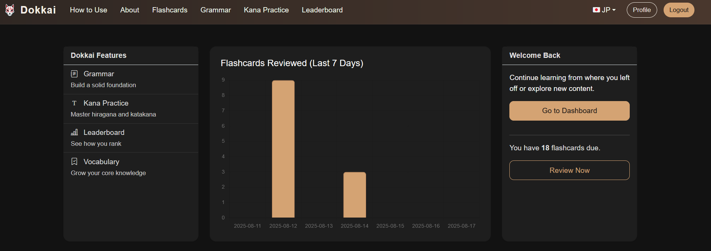
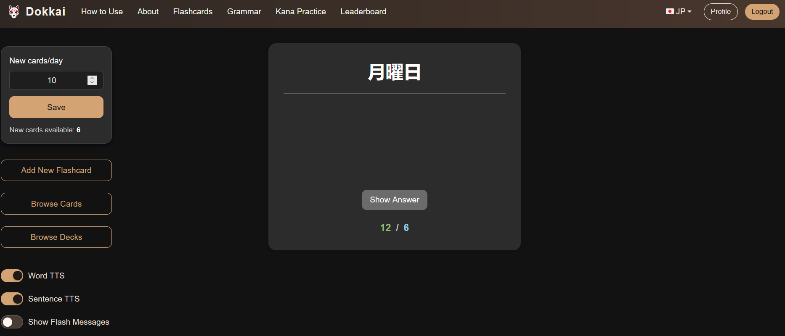
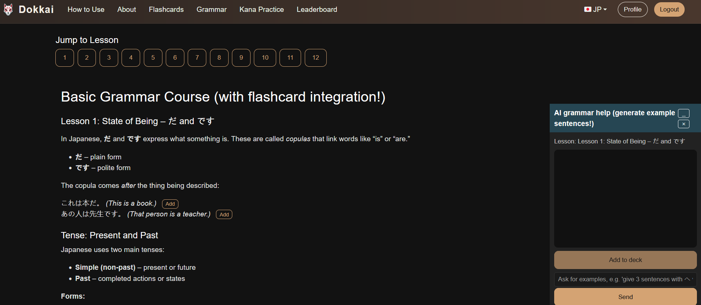
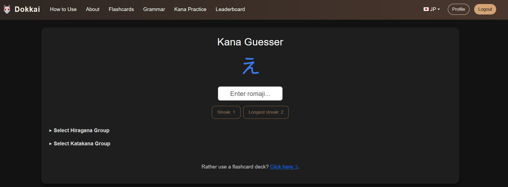
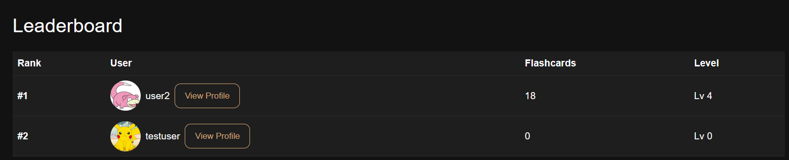
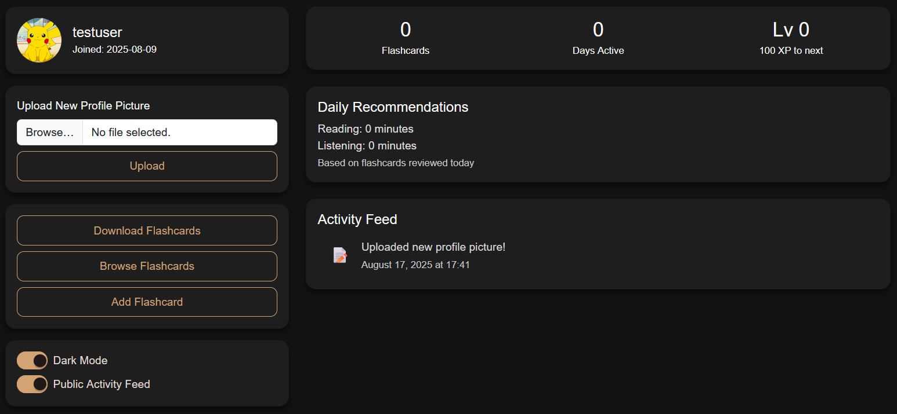

# Dokkai

Language learning web app. Users can create and review flashcards (custom or pre-made, scheduled with FSRS algorithm), study grammar concepts with examples, get new generated practice sentences and make flashcards out of them, and use a kana guesser game with high scores for each account. There are also profiles, XP, and leaderboards. Built with Flask and SQL with the front end using HTML/CSS/JS and Bootstrap stuff for styling.

